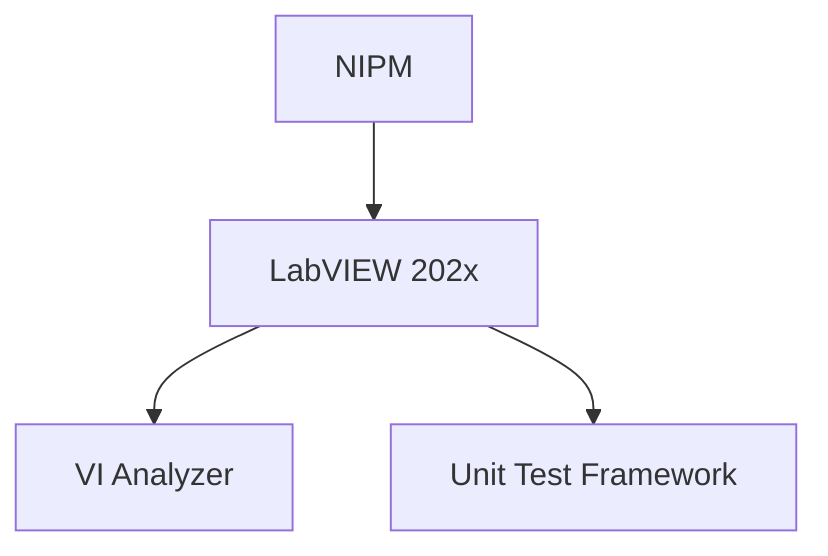

# LabVIEW Docker

This repo contains docker files for building LabVIEW 2021 and 2022 Docker images

## Docker Hierarchy

```mermaid
graph TB
ID-1[NIPM]
ID-2[LabVIEW 202x]
ID-3[VI Analyzer]
ID-4[Unit Test Framework]
ID-1 --> ID-2
ID-2 --> ID-3
ID-2 --> ID-4
```
