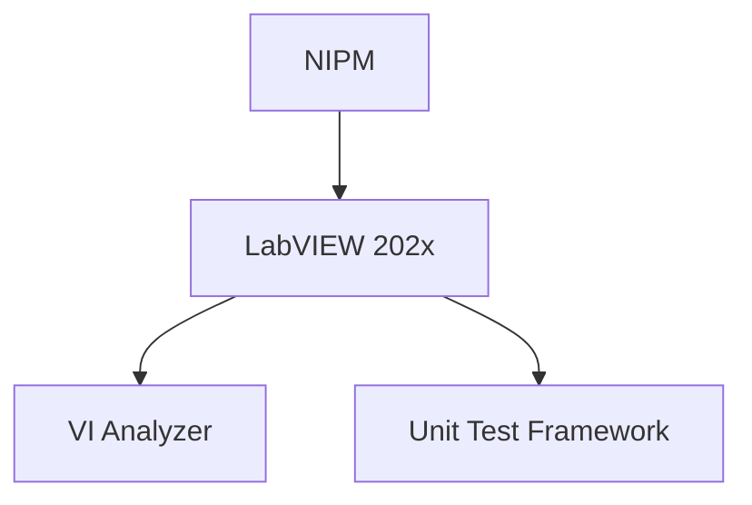

# LabVIEW Docker

This repo contains docker files for building LabVIEW 2021 and 2022 Docker images

LabVIEW 2023 not supported yet due to error installing the latest NI Package Manager

## Docker Hierarchy

